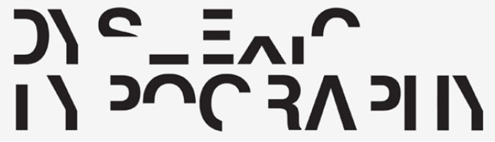

Dyslexia has been labelled as a, "[hidden disability (pdf)](http://dyslexiahelp.umich.edu/sites/default/files/good_fonts_for_dyslexia_study.pdf)" with neurological roots. Not only because you can't tell if someone is dyslexic by looking at them, but often times, they can't tell either. A person with dyslexia, in their natural state (and depending on the severity) cannot tell if they're reading or writing incorrectly. Because of this, and despite the popularization of it through people like [Steve Jobs](http://dyslexiahelp.umich.edu/success-stories/steve-jobs) and [Steven Spielberg](http://www.landmarkoutreach.org/about/newsworthy/steven-spielberg-deals-dyslexia-0), it's very much under the radar and often forgotten about.

But for a hidden disability, the statistics show that it's pretty widespread. From 10 to 17.5% of the population in the U.S.A. and from 8.6 to 11% of the Spanish speaking population have this cognitive disability ([source](http://dyslexiahelp.umich.edu/sites/default/files/good_fonts_for_dyslexia_study.pdf)). That's a pretty significant percentage, sometimes even higher than IE, depending on the project.

How does this connect to us? Written text is obviously a huge part of what we do, and typography is the backbone we lean on to create a good reading experience for our users. When a user who has dyslexia goes through a site, depending on the typography, it can make or break an experience.

## Dyslexia and Reading

Unless you have dyslexia, it's really hard to understand what it's like. Daniel Britton created a [typeface](http://www.boredpanda.com/dyslexic-typrface-daniel-britton/) to communicate just that: what someone with dyslexia experiences while reading. The typeface isn't meant to show the letter shapes that are experienced, but rather the difficulty level for comparison. To quote Daniel:

> What this typeface does is break down the reading time of a non-dyslexic down to the speed of a dyslexic. I wanted to make non-Dyslexic people understand what it is like to read with the condition and to recreate the frustration and embarrassment of reading everyday text and then in turn to create a better understanding of the condition.

This is and example of the typeface in use, spelling out, "Dyslexic Typography." The empathy that this simple exercise instills is staggering.

Even in this short form, you can see how difficult the text is to read. Daniel also has an example of an entire paragraph, which I'll spare you from but feel free to [view the example on his web site](http://danielbritton.info/dyslexia).

For most people with dyslexia they can see the letters perfectly fine, but there's a communication problem with the brain, which causes difficulty reading.

## Typography Implementation

Not too long ago an open source font was created to make the reading experience better for users with dyslexia, it's called [OpenDyslexic](http://opendyslexic.org/), and it's pretty ugly (but readable). The main principles of the typeface are to add more weight to the bottom of letters to imply a typographic direction (this is the bottom of the letter) making the letters easier to process. The letters also have slightly more unique shapes to differentiate themselves a bit more.

Unless you're building a site where the target audience is dyslexic, you probably won't be using OpenDyslexic any time soon, but there are some realistic things we can focus on while building out a typographic system.

[A recent study](http://dyslexiahelp.umich.edu/sites/default/files/good_fonts_for_dyslexia_study.pdf) at the University of Michigan concluded that:

> "\[...\]font types have an impact on readability of people with dyslexia. Good fonts for people with dyslexia are Helvetica, Courier, Arial \[and \] Verdana \[...\] taking into consideration both, reading performance and subjective preferences. Also, sans serif, monospaced, and roman font types increased significantly the reading performance, while italic fonts decreased reading performance."

Basically San-serif and Monospaced fonts are the best and italics are awful in all forms.

Mostly, we can create an environment of universal design including users with dyslexia by following good typography principles like: using proper line height and length, providing large enough and clear text, spacing out letters in uppercase words. Lower and mixed-case letters are easier to read than all uppercase, because they create variations in the shape of the word (for people without dyslexia as well). Going the extra mile to stick with sans-serif fonts, I'm sure, would be greatly appreciated for any affected users.

This is just something to think about when you're building or designing content. I like to think about this stuff because it reminds me that accessibility isn't just for the blind or deaf, there are many types of disabilities to many varying degrees. These hidden ones are especially important because you never know who or which users may be affected.

## Resources and Further Reading

- [Dyslexic Typeface: I Created A Font To Show How Hard It Is To Read For Dyslexics](http://www.boredpanda.com/dyslexic-typrface-daniel-britton/)
- [Good Fonts for Dyslexia (PDF)](http://dyslexiahelp.umich.edu/sites/default/files/good_fonts_for_dyslexia_study.pdf)
- [Typefaces for Dyslexic Users](https://bdatech.org/what-technology/typefaces-for-dyslexia/)
- [Open Dyslexic Typeface](http://opendyslexic.org/)
