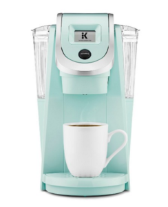

Last weekend I was having a yard sale and I woke up at 6am so I could get some things ready, make breakfast, coffee, read a [comic](http://www.dccomics.com/comics/batman-2016/batman-16), and have a little time to relax before I had to sit outside for 5 hours and haggle with people over $0.50.

For those who don't know me, I'm a hyper-scheduler. I think of everything I need to do and how long each task takes so I can make sure I stay on time (I hate being late -- in fact, I'd rather be 15 minutes early that 5 minutes late). On this particular morning I had all my things timed out, but there was 1 item that threw me way off and it made me stop and think about how tasks (at work) are estimated and why we "pad" time and give huge ranges.

It was my coffee. Let me walk you through it.

## Making Coffee

I have a Keurig and it takes about 40 seconds to brew a cup of coffee, but I don't use standard k-cups. I grind whole beans once a week and put them in a reusable cup each time (it saves money, and ya know... the earth). So that adds a little time, but not much. Let's say the estimate for coffee making is: 2 minutes. Sounds like a pretty reasonable estimate for someone using a Keurig, right?

So that was my time estimate, but here's what actually happened:

1. I had used all the last of the ground coffee the day before
2. I left the reusable k-cup in the Keurig
3. The trash was full (you have to empty the k-cup into the trash)
4. All the coffee mugs where in the dishwasher

Now my 2 minute task included: grinding more coffee, taking the trash out, putting a new trash bag in, cleaning a coffee mug, cleaning the used k-cup, and finally brewing the coffee. Then of course, cleaning the now-used k-cup.

All in all, it was about 12mins. So, if I were to use that experience then next time I would have to estimate 2-12 mins to make coffee. 10 minutes for coffee seems like a long time, and an 8 minute buffer window also seems aggressive, but now we know what-all can go wrong so next time my yard sale (aka your project) will start (ship) on time.

That is how time estimates work, and that's why experience matters. Don't be the person who estimates 2 minutes for a cup of coffee and rolls in 10 minutes late with that sweet caffeine.

Or, just drink water in the morning, because it's better for you anyway
