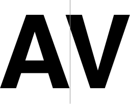
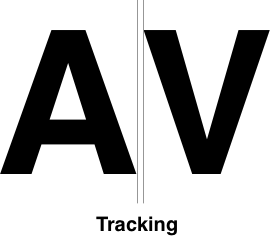

Among the growing list of geekery I latch onto, typography has always been a main focus of my learning. Believing that content is the center of our web and the many hooks it has within CSS, it has always felt like a natural extension to executing my job. From choosing a typeface, setting up a typographic system, all the way to proper asset loading and subsetting to maintain a performant experience - I've always been extremely interested in all aspects of typography.

About 5 years ago I was interviewing someone who was able to speak at length about the difference between a typeface and a font (Summary: _font_ is the physical file, _typeface_ is how it looks) and I was blown away by that level of intricate knowledge of such a basic concept.

That is one of the main reasons you hear me speak about the difference between **X** and **Y** or focusing so heavily on the words we use. I very much enjoy looking into the little details of a topic and bubbling them to the surface - which is the purpose of this article. I want to take some time to discuss fine-grained typography and the difference between two popular concepts we use: **Kerning** and **Tracking**. In the engineering world these two terms are often mashed together under, "letter spacing," but they're a little different, so let's dive in.

## Kerning

"Kerning," is often confused with Tracking, in that is does refer (to some extent) to the space between characters, but more so it is how characters fit together (not [ligatures](https://en.wikipedia.org/wiki/Typographic_ligature), that's a different thing entirely). Kerning brings letters a little closer together or further away on a character by character basis. Good kerning will help, "warm up" the feeling of a typeface while bad kerning will make you feel dead inside (ok, that's a little dramatic).

In the example image you can see that the letters A & V are pulled together because their shapes make them seem naturally far apart (even though they are not) and this creates uneven spacing in words. Alternatively, you see monospace typefaces that don't do any kerning and have a more robotic feeling to them.

Kerning is built into the typeface, but you can turn off and on the feature with the CSS property [font-kerning](https://developer.mozilla.org/en-US/docs/Web/CSS/font-kerning). You probably won't use it much and turning it off will likely make the typeface designer hunt you down, but it's still good to know it's in your toolbelt just incase a font gives you trouble.

## Tracking

"Tracking," is how much horizontal space there is between characters in a word. Once the Kerning is carefully set (usually done within the typeface) you can adjust the spacing throughout an entire word. This can be done programmatically within CSS (letter-spacing), but is also done within the typeface, similar to Kerning. A good typeface won't need any tracking adjustments if you're sticking to the standard letter combinations (all lowercase or mixed-case words).

Tracking should be used with care because it can quickly introduce readability issues if letters are too far apart. Generally speaking, the only time you would increase letter spacing is if you are using all uppercase letters. Uppercase letters are not usually designed to sit next to each other, so words can get a little tight and difficult to read. It is especially problematic for users with [dyslexia](https://timwright.org/blog/2017/02/04/dyslexia-typography/) (see how I looped that back around?) because the height uniformity that uppercase words create makes them harder to read. Words with variable height letters (mixed or lower case) are easier for the brain to process. Spacing out the letters will increase the readability because it introduces tiny visual gaps to the eye.

## Why is this important?

Beside the fact that we all make websites for a living and this kind of thing is our business to know, typography is a critical component in creating a good user experience. Bad reading in places like Reddit, Craigslist or _\[insert really popular, but horribly designed site here\]_ leave the user with, at best, a utilitarian and forgettable experience. When a site or application pays attention to the typographic experience of a user it can go a long way. Anyone can load Open Sans from Google fonts and leave it as-is, but those who go the extra mile and understand the ins and outs of the design system will have an edge over getting that elusive user to return.

In the end, isn't that our goal?

## Resources and Further Reading

- [Letter Spacing](http://practicaltypography.com/letterspacing.html)
- [Font Kerning in CSS](https://developer.mozilla.org/en-US/docs/Web/CSS/font-kerning)
- [Letter Spacing in CSS](https://developer.mozilla.org/en-US/docs/Web/CSS/letter-spacing)
